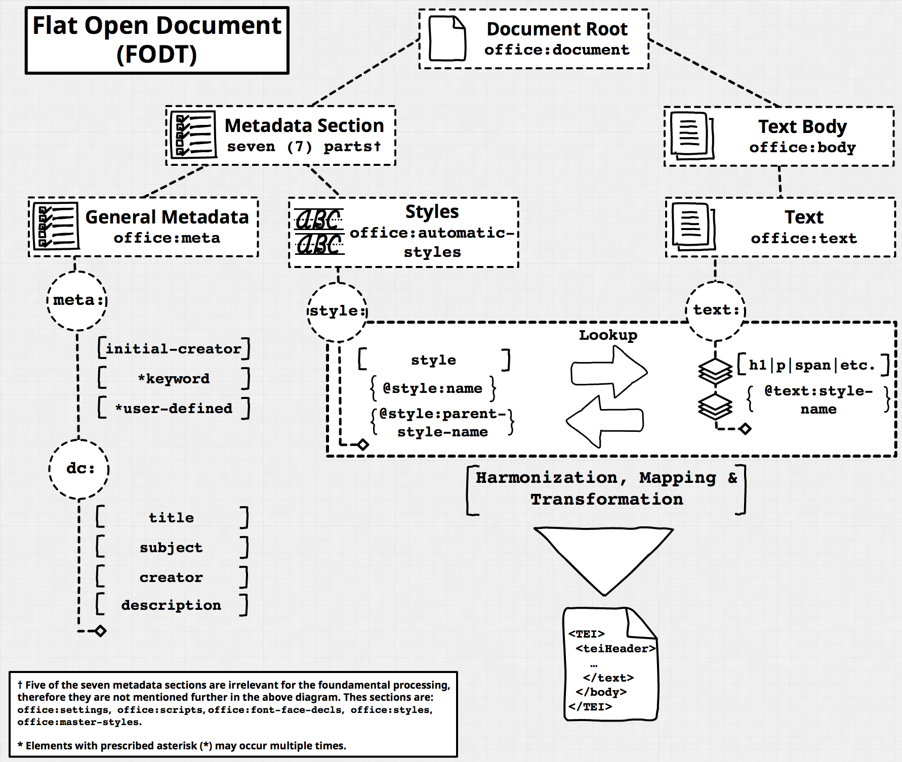
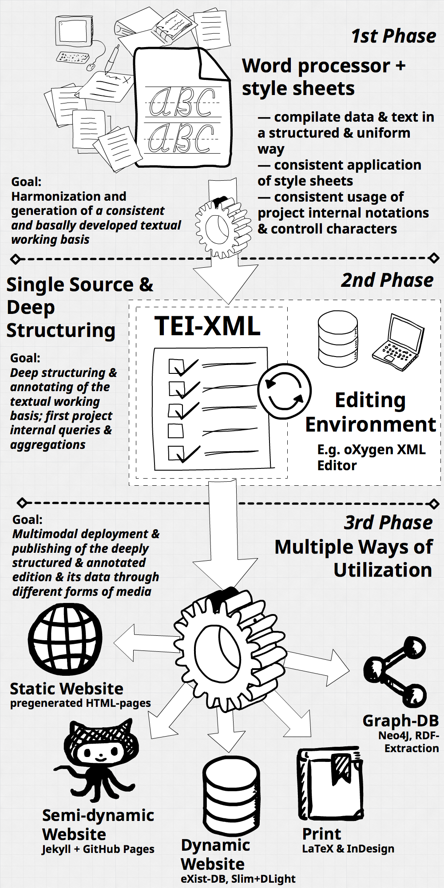

# xslt-simple-text-processing-toolbox <!-- omit in toc -->

*Important*: This repository is still work in progress.

<!-- TOC START min:1 max:3 link:true asterisk:false update:false githubCompatibility:true -->
- [Scripts](#scripts)
  - [Flat Open Document (FODT)](#flat-open-document-fodt)
    - [Transformation to Base XML](#transformation-to-base-xml)
    - [Transformation to Base HTML](#transformation-to-base-html)
    - [Transformation to JSON](#transformation-to-json)
  - [MS Word (DOCX)](#ms-word-docx)
  - [InDesign Markup Languag (IDML)](#indesign-markup-languag-idml)
    - [Transformation to Base XML](#transformation-to-base-xml-1)
  - [Mark Down (MD)](#mark-down-md)
- [Workflows &amp; Concepts](#workflows-amp-concepts)
  - [Common Formats](#common-formats)
    - [Markdown](#markdown)
    - [XML](#xml)
    - [JSON](#json)
  - [A Minimal Approach to Digital Editions](#a-minimal-approach-to-digital-editions)
  - [Base Bibliography](#base-bibliography)
    - [English](#english)
    - [German](#german)
- [Working with XML – Software, Tools, Libraries](#working-with-xml-%e2%80%93-software-tools-libraries)
  - [oXygen XML Editor](#oxygen-xml-editor)
  - [Python](#python)
  - [Using XSL-Transformation with Saxon/C in Python](#using-xsl-transformation-with-saxonc-in-python)
    - [MacOS](#macos)
    - [Using XSLT files in Saxon/C Python API](#using-xslt-files-in-saxonc-python-api)
  - [eXist XML Database](#exist-xml-database)
- [Licenses](#licenses)
  - [Scripts](#scripts-1)
  - [Texts &amp; Images](#texts-amp-images)
<!-- TOC END -->


This repository collects concepts, procedures, and simple XSLT files for text processing, e.g. to simplify InDesign documents (.idml) to simplified XML, or Office formats (.fodt, .odt, .docx) to simplified XML. Subsequently the simplified XML may function as a foundation from where nested TEI-P5-XML may be generated.

The following sections explain the [scripts](#scripts) that may be used to process the source files. The scripts sections are followed by a section that exemplifies several concepts, workflows, and approaches to text processing and transformation of XML based text files into TEI-XML.

## Scripts

The scripts are organised in folder that follow the following convention: `input_format/software/output_format/xslt_file.xsl`

### Flat Open Document (FODT)

The **Flat Open Document Format** ([FODT](https://en.wikipedia.org/wiki/OpenDocument_technical_specification#File_types)) is a clearly and concisely structured XML format  representing the structure of a LibreOffice text document. Every ODT/F document created by [LibreOffice](https://www.libreoffice.org/) may be saved as an FODT file.

FODT contains all the **metadata**, **styles**, and **structural information** one may expect from a LibreOffice document. It’s conciseness, however, makes it **easy to transform**. The below schematic gives an overview over the basic structure of an FODT file.



Contrary to ODT/F and DOCX, an FODT file is a **standalone XML file** – that may be opened and processed as such without changing the file extension – and not an archive file that bundles several (heterogenous) files.

The fact that FODT is a single file format makes it especially useful for workflows that incorporate **version control** via Git or SVN.

#### Transformation to Base XML

* `fodt2base_XML_elements.xsl` (oxygen, saxon)
* `fodt2base_XML_elements_attributes.xsl` (oxygen, saxon)
* `fodt2base_XML_complex.xsl` (oxygen)

#### Transformation to Base HTML

* `fodt2base_HTML_elements_attributes.xsl` (oxygen)

#### Transformation to JSON

* `fodt2base_json_elements.xsl` (saxon)
* `fodt2base_json_reduced.xsl` (saxon)

### MS Word (DOCX)

Nothing here yet …

### InDesign Markup Languag (IDML)

The [IDML specification](https://wwwimages.adobe.com/content/dam/acom/en/devnet/indesign/sdk/cs6/idml/idml-specification.pdf) may.

#### Transformation to Base XML

* `idml2base_XML.xsl.xsl` (oxygen)

### Mark Down (MD)

Nothing here yet …

## Workflows & Concepts

### Common Formats

#### Markdown


#### XML


#### JSON

The **JavaScript Object Notation** (JSON, see [1](https://en.wikipedia.org/wiki/JSON), [2](https://www.w3schools.com/js/js_json_intro.asp), [3](https://json.org/)) provides a slim, hierarchical data structure basically consisting of **key value pairs**.

**Keys** have to be **strings**, **values** may be **strings** (in `"…"`), **numbers**, **booleans**, **arrays** (aka lists, in `[…]`), or, additional, **JSON objects** (in `{…}`).

A basic, explanatory JSON structure modelling a bibliographical entry:

```JavaScript
{
  "title": {
    "main": "Digital Humanities",
    "sub": "Eine Einführung"
  },
  "editors": [
    "Jannidis, Fotis",
    "Kohle, Hubertus",
    "Rehbein, Malte"
  ],
  "published": 2017,
  "publisher": "J.B. Metzler",
  "chapters": [
    {
      "author": "Thaller, Manfred",
      "title": "Geschichte der Digital Humanities",
      "pages": [ 3, 12 ]
    },
    {
      "author": "Thaller, Manfred",
      "title": "Digital Humanities als Wissenschaft",
      "pages": [ 13, 18 ]
    }
  ],
  "price": {
    "ebook": 22.99,
    "softcover": 29.95
  }
}
```

### A Minimal Approach to Digital Editions



### Base Bibliography

#### English

* **Flanders**, Julia/**Jannidis**, Fotis (2019): _Data modeling in a digital humanities context_, in: Flanders, J./Jannidis, F.: [The Shape of Data in Digital Humanities](https://www.taylorfrancis.com/books/e/9781315552941). Modeling Texts and Text-based Resources. London, pp. 3–25.
* **Flanders**, Julia/**Jannidis**, Fotis (2019): _A gentle introduction to data modeling_, in: Flanders, J./Jannidis, F.: [The Shape of Data in Digital Humanities](https://www.taylorfrancis.com/books/e/9781315552941). Modeling Texts and Text-based Resources. London, pp. 26–96.

#### German

* **Jannidis**, Fotis (2017): _Grundlagen der Datenmodellierung_, in: Jannidis, F. et al.: [Digital Humanities](https://www.springer.com/de/book/9783476026224). Eine Einführung. Stuttgart, pp. 99–108.
* **Vogeler**, Georg/**Sahle**, Patrick (2017): _XML_, in: Jannidis, F. et al.: [Digital Humanities](https://www.springer.com/de/book/9783476026224). Eine Einführung. Stuttgart, pp. 128–146.


## Working with XML – Software, Tools, Libraries

### oXygen XML Editor

The [oXygen XML Editor](https://www.oxygenxml.com/) provides one of the best prorpietary **integrated development environments** (IDE) for the development with XML and XML related technologies.

Additionally, the oXygen XML Editor provides scholars with the opportunity to set up  their own **individualized working environment** by implementation of a _document type association_ (DTA). A DTA within oXygen is a bundle of configurations and configuration files, transformation scenarios, and CSS files that generate an individualized GUI overlay for editing, transforming, and querying of XML files. One well known DTA – at least in German speaking _DH_ community – is [Ediarum](http://www.bbaw.de/telota/software/ediarum).

### Python

* Beautiful Soup 4
    * Docs: [https://www.crummy.com/software/BeautifulSoup/bs4/doc/](https://www.crummy.com/software/BeautifulSoup/bs4/doc/)
    * Tutorial: [https://programminghistorian.org/en/lessons/intro-to-beautiful-soup](https://programminghistorian.org/en/lessons/intro-to-beautiful-soup)
* lxml
    * Docs: [https://lxml.de/](https://lxml.de/)
    * Tutorial: [https://lxml.de/tutorial.html](https://lxml.de/tutorial.html)

### Using XSL-Transformation with Saxon/C in Python

*Important*: Before moving, copying, and deleting files in your file system please make sure that you know what you do! Erratic moving and deleting of files may have disastrous consequences! The walkthrough below is based on my own file system and system setup and should only be used as a guideline and in a reasonable way.

#### MacOS

Since october 2019 the Saxon/C library for XSLT & XQuery processing has a native [Python](https://www.saxonica.com/saxon-c/doc/html/saxonc.html) API available (C++, Java, and [PHP](http://www.saxonica.com/saxon-c/doc/html/index.html#php-api) APIs are available as well, see [here](http://www.saxonica.com/saxon-c/index.xml)). Following, I will give a short walkthrough on how one may set everything up on MacOS to usage in a Jupyter Notebook (the walkthrough follows the information provided with the Saxon/C library):

1. Installing Python 3 and the Jupyter library.
    1. Download and install Python from the [official website](https://www.python.org/downloads/) (Don’t forget to let the installer add Python to the PATH-variable).
    1. [Install](https://jupyter.org/install) the Jupyter library, e.g. via PIP: `pip3 install jupyter`.
    1. [Install](https://pypi.org/project/Cython/) the Cython library, e.g. `pip3 install Cython`
1. Installing Saxon/C for Python on MacOS (*please consult the README file distributed with the Saxon/C library as well*).
    1. Download the Saxon/C-HE ZIP-file from the [Saxonica-website](http://www.saxonica.com/download/c.xml).
    1. Navigate into your Downloads folder: `cd ~/Downloads/`
    1. Create a temporary folder for the files, e.g.: `mkdir temp_saxon`
    1. Move the ZIP-file into the temporary folder: `mv libsaxon-HEC-mac-setup-v1.2.0.zip temp_saxon/`
    1. Move into the temporary folder `cd temp_saxon` and extract the ZIP-file, e.g.: `unzip libsaxon-HEC-mac-setup-v1.2.0.zip`
    1. move the files into your `/usr/local/lib/` folder:
        1. `cp libsaxonhec.dylib /usr/local/lib/`
        1. `cp -r rt /usr/local/lib/`
    1. Adjust your `PATH` environment variables in your `.bash_profile` or your `.zshrc` shell configuration file:
        1. `export JET_HOME=/usr/local/lib/rt`
        1. `export DYLD_LIBRARY_PATH=$JET_HOME/lib/jetvm:$DYLD_LIBRARY_PATH`
    1. Now move back into your temporary folder and from there into the folder where the Python API files are located `cd ~/Downloads/temp_saxon/Saxon.C.API`
    1. Move the folder `python-saxon` to where you want to keep the Python extension. From this location the Saxon/C library will be imported into your Python scripts, e.g. `cp -r python-saxon /Users/houzi/`.
    1. Then move into this folder `cd /Users/houzi/python-saxon` and build the Python extension `python3 saxon-setup.py build_ext -if`
    1. Now you may import the `saxonc` library from your scripts after adding your `saxon-python` folder to the `sys.path`. In your script or console start with the following:
        1. `import sys`
        1. `sys.path.append("/Users/houzi/python-saxon")`
        1. `import saxonc`

#### Using XSLT files in Saxon/C Python API

```Python
# import the sys library to be able to append your Saxon/C Python API folder to the library loading path
import sys
sys.path.append("/Users/houzi/python-saxon")
# import the Saxon/C library
import saxonc
# import other libraries you may need, e.g. JSON
import json

with saxonc.PySaxonProcessor(license=False) as proc:
    print(proc.version)
    # Initialize the XSLT 3.0. processor
    xsltproc = proc.new_xslt30_processor()
    # set the directory where your XML & XSLT files are located
    xsltproc.set_cwd('docs')
    # set the XSLT 3.0 processor’s result to a raw string
    xsltproc.set_result_as_raw_value(True)
    # set your source file, e.g. the XML file you want to transform, on the  XSLT 3.0 processor
    xsltproc.set_initial_match_selection(file_name="flat_open_office_document.fodt")
    # apply your XSLT stylesheet on the  XSLT 3.0 processor
    result = xsltproc.apply_templates_returning_string(stylesheet_file="fodt2base_json_reduced.xsl")
    # Write the string output to a file, e.g. to a JSON file
    with open("test.json",'w') as file:
        file.write(result)
    # load the JSON string result for further work within Python
    j = json.loads(result)
    # Print the result
    print(j)
```

### eXist XML Database

* Docs: [http://www.exist-db.org/exist/apps/doc/](http://www.exist-db.org/exist/apps/doc/)
* Tutorial: [https://howto.acdh.oeaw.ac.at/blog/books/how-to-build-a-digital-edition-web-app/](https://howto.acdh.oeaw.ac.at/blog/books/how-to-build-a-digital-edition-web-app/)

## Licenses

### Scripts

MIT License

Copyright (c) 2019–2020 Max Grüntgens (猴子)

Permission is hereby granted, free of charge, to any person obtaining a copy
of this software and associated documentation files (the "Software"), to deal
in the Software without restriction, including without limitation the rights
to use, copy, modify, merge, publish, distribute, sublicense, and/or sell
copies of the Software, and to permit persons to whom the Software is
furnished to do so, subject to the following conditions:

The above copyright notice and this permission notice shall be included in all copies or substantial portions of the Software.

THE SOFTWARE IS PROVIDED "AS IS", WITHOUT WARRANTY OF ANY KIND, EXPRESS OR
IMPLIED, INCLUDING BUT NOT LIMITED TO THE WARRANTIES OF MERCHANTABILITY,
FITNESS FOR A PARTICULAR PURPOSE AND NONINFRINGEMENT. IN NO EVENT SHALL THE
AUTHORS OR COPYRIGHT HOLDERS BE LIABLE FOR ANY CLAIM, DAMAGES OR OTHER
LIABILITY, WHETHER IN AN ACTION OF CONTRACT, TORT OR OTHERWISE, ARISING FROM,
OUT OF OR IN CONNECTION WITH THE SOFTWARE OR THE USE OR OTHER DEALINGS IN THE
SOFTWARE.

### Texts & Images

<a rel="license" href="http://creativecommons.org/licenses/by/4.0/"></a><br />This work is licensed under a <a rel="license" href="http://creativecommons.org/licenses/by/4.0/">Creative Commons Attribution 4.0 International License</a>.